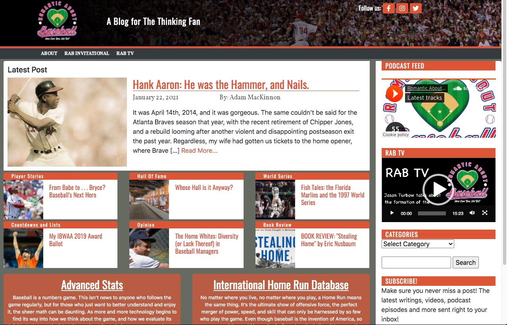
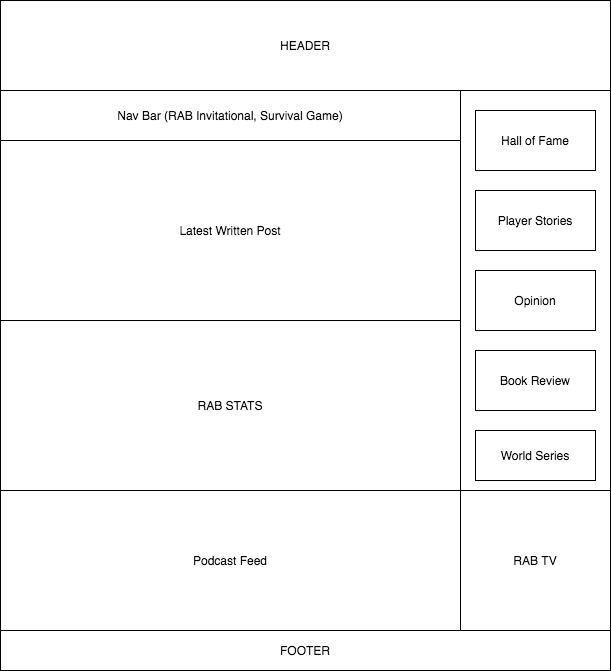
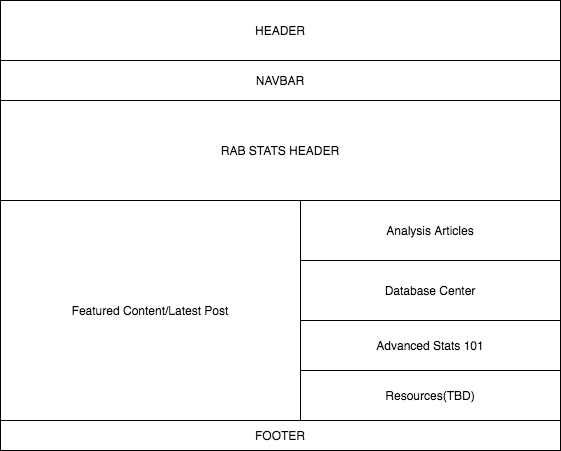
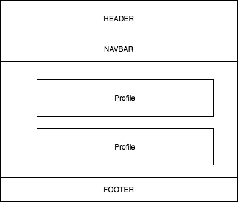

This project is a complete front-end redsign of the blog, "Romantic About Baseball"

Currently hosted on Wordpress and coded in PHP, this project will convert the code to REACT/REDUX front end, and eventually integrate a NODE.js backend (to come later)

Current Snapshot of home page:

PAGES:
1. Home Page
2. RAB Stats Page
3. About Page

concept drawing of new home page:

Concept Drawing of new Stats Page:

Concept Drawing of About Us page:

